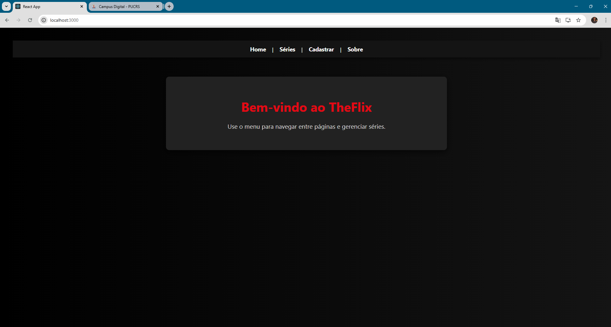
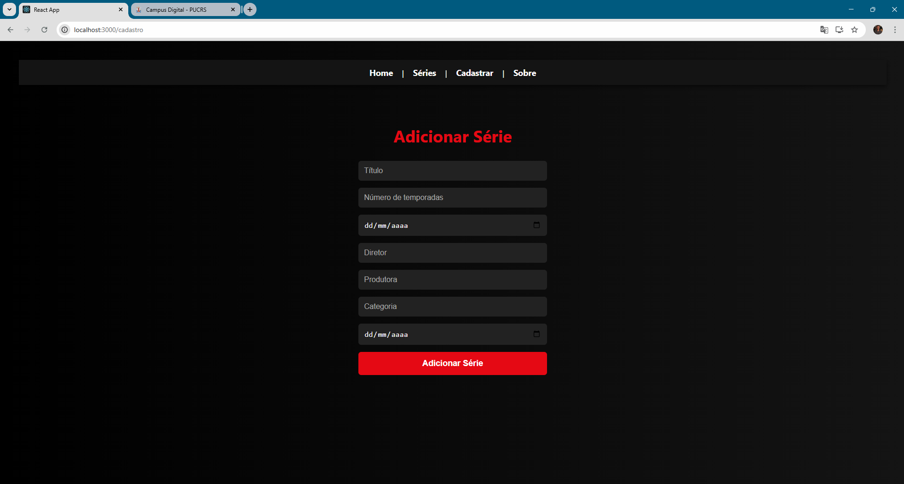
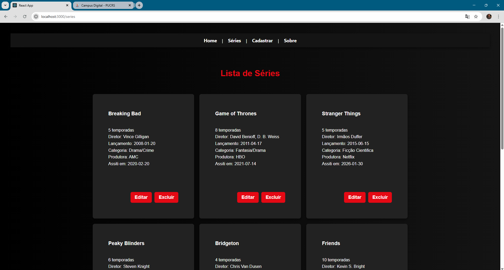

#  Series Registration and Management Project

##  Identification

- **Student:** Theo Phonlor Perez  
- **Project:** Phase 1 - Series Registration and Management  
- **Course:** Frontend Development  

---

##  Introduction

This project is a **ReactJS** application that allows users to manage a list of series.

###  Features

-  Add new series  
-  List all registered series  
-  Edit existing series information  
-  Delete series  

---

##  Technologies Used

- **ReactJS**  
- **React Router** – navigation between pages  
- **useState** – state management  
- **localStorage** – simple data persistence in the browser  

---

#  How to Run the Project

###  Extract the File

Extract the provided file:

```
theo_phonlor_perez-projeto-fase-1.zip
```

---

###  Access the Project Folder

Open the terminal in the folder where the project was extracted and run:
```bash
cd theo_phonlor_perez-projeto-fase-1
```

---

###  Install dependencies

```bash
npm install
```

---

###  Start the application

```bash
npm start
```

---

###  Open in the browser

After starting the project, the application will automatically open at:

```
http://localhost:3000
```

The application must run on port 3000 to work properly!!

---

#  Component structure

The application components are located in:

```
./src/components
```

They are responsible for structuring the interface and organizing the functionalities.

---

##  NavBar

Component responsible for navigation between application pages.

Uses **React Router** to manage routes.

### Available links:

- Home  
- About  
- Series Registration  
- Series List  

---

##  SerieForm

Component responsible for **registering new series**.

###  Form Fields

- Title  
- Number of Seasons  
- Release Date  
- Director  
- Production Company  
- Category  
- Date watched by the user  

All fields are required.

When submitting the form, the **`adicionarSerie`** function is called to save the new series.

---

##  SerieList

Component responsible for **listing all registered series**.

Each series is displayed in a **card format**, containing its information.

###  Available Features

-  **Edit series**

  When clicking "editar", **prompts** are displayed allowing all series fields to be modified.

-  **Delete series**

  Removes the series from the list clicking "excluir" and updates the storage in **localStorage**.

---

#  Application Pages

The pages are located in:

```
./src/pages
```

---

##  Home

Home page of the application.

Displays a welcome message to the user and presents the purpose of the system.

---

##  About

Informational page named "sobre", containing a description of the project and its purpose within the course.

---

#  Styling

The application's styling was implemented using **separate CSS files for each component**.

Responsible for:

- Layout of the series cards  
- Button styling  
- Organization of the listing 

---

#  Application images

###  Home




###  About - "sobre"


###  Registration page - "Cadastrar"





###  List page - "Séries"




### Showing editing functionality


---

# Conclusion

This project represents **Phase 1** of the application development.

During this stage, the following concepts were implemented:

* Layout structuring with **React components**
* Page navigation using **React Router**
* Simple data persistence using **localStorage**
* State management with the **useState** hook

The application serves as a foundation for future evolutions, which may include improvements such as:

* More advanced interface
* Database integration
* User authentication
* API integration

---
