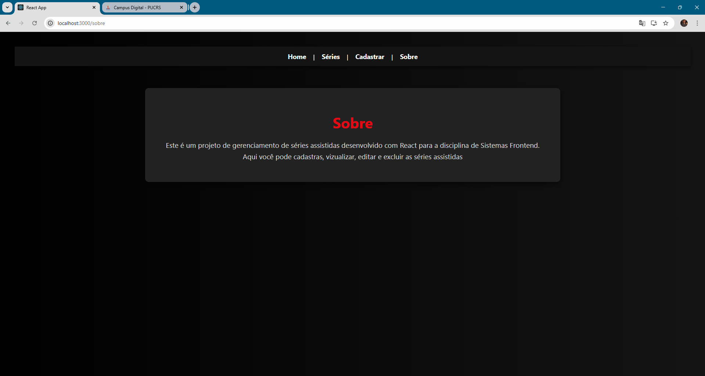
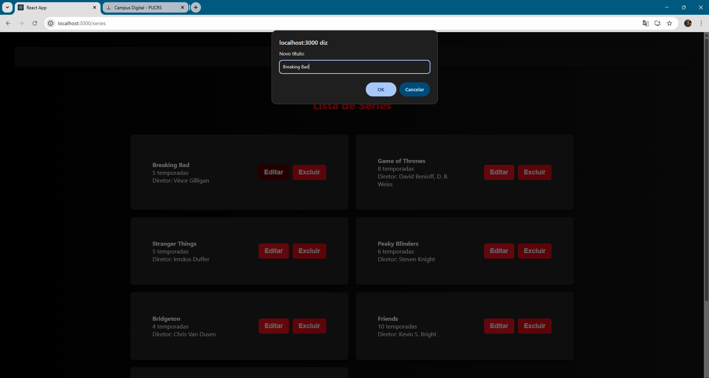

#  Projeto de Cadastro e Lista de Séries

##  Identificação

* **Aluno:** Theo Phonlor Perez
* **Projeto:** Fase 1 - Cadastro e Gerenciamento de Séries
* **Disciplina:** Desenvolvimento Frontend

---

##  Introdução

Este projeto consiste em uma aplicação desenvolvida em **ReactJS** que permite ao usuário gerenciar uma lista de séries.

A aplicação possui funcionalidades para:

*  Cadastrar novas séries
*  Listar todas as séries cadastradas
*  Editar informações de séries existentes
*  Excluir séries

O objetivo do projeto é demonstrar o uso de:

* **React Router** para navegação entre páginas
* **useState** para gerenciamento de estado
* **localStorage** para persistência simples de dados no navegador

---

#  Como executar o projeto

###  Descompactar o arquivo

Extraia o arquivo entregue:

```
theo_phonlor_perez-projeto-fase-1.zip
```

---

###  Acessar a pasta do projeto

Abra o terminal na pasta onde o projeto foi extraído e execute:

```bash
cd theo_phonlor_perez-projeto-fase-1
```

---

###  Instalar as dependências

```bash
npm install
```

---

###  Iniciar a aplicação

```bash
npm start
```

---

###  Acessar no navegador

Após iniciar o projeto, a aplicação abrirá automaticamente em:

```
http://localhost:3000
```

Para funcionar deve ser aberta na porta 3000 !!

---

#  Estrutura de Componentes

Os componentes da aplicação estão localizados em:

```
./src/components
```

Eles são responsáveis por estruturar a interface e organizar as funcionalidades.

---

##  NavBar

Componente responsável pela navegação entre as páginas da aplicação.

Utiliza **React Router** para gerenciar as rotas.

Links disponíveis:

*  Home
*  Sobre
*  Cadastro de Séries
*  Lista de Séries

---

##  SerieForm

Componente responsável pelo **cadastro de novas séries**.

### Campos do formulário

* Título
* Número de Temporadas
* Data de Lançamento
* Diretor
* Produtora
* Categoria
* Data em que o usuário assistiu

Todos os campos são obrigatórios.

Ao enviar o formulário, a função **`adicionarSerie`** é chamada para salvar a nova série.

---

##  SerieList

Componente responsável por **listar todas as séries cadastradas**.

Cada série é exibida em formato de **card**, contendo suas informações.

### Funcionalidades disponíveis

*  **Editar série**

  Ao clicar em editar, são exibidos **prompts** permitindo alterar todos os campos da série.

*  **Excluir série**

  Remove a série da lista e atualiza o armazenamento no **localStorage**.

---

#  Páginas da Aplicação

As páginas estão localizadas em:

```
./src/pages
```

---

##  Home

Página inicial da aplicação.

Exibe uma mensagem de boas-vindas ao usuário e apresenta o objetivo do sistema.

---

##  Sobre

Página informativa contendo uma descrição do projeto e sua finalidade dentro da disciplina.

---

#  Falando da Estilização

A estilização da aplicação foi realizada utilizando **arquivos CSS separados para cada componente**.


Responsável por:

* Layout dos cards das séries
* Estilo dos botões
* Organização da listagem

---

#  Imagens da Aplicação

###  Página Inicial


###  Página Sobre





###  Página de Cadastro


###  Página de Listagem


### Mostrando funcionalidade da edição





---

#  Conclusão

Este projeto representa a **Fase 1** do desenvolvimento da aplicação.

Durante esta etapa foram implementados os seguintes conceitos:

*  Estruturação de layout com **componentes React**
*  Navegação entre páginas utilizando **React Router**
*  Persistência simples de dados utilizando **localStorage**
* Gerenciamento de estado utilizando o hook **useState**

A aplicação serve como base para evoluções futuras, podendo incluir melhorias como:

* Interface mais avançada
* Banco de dados
* Autenticação de usuários
* Integração com APIs

---
